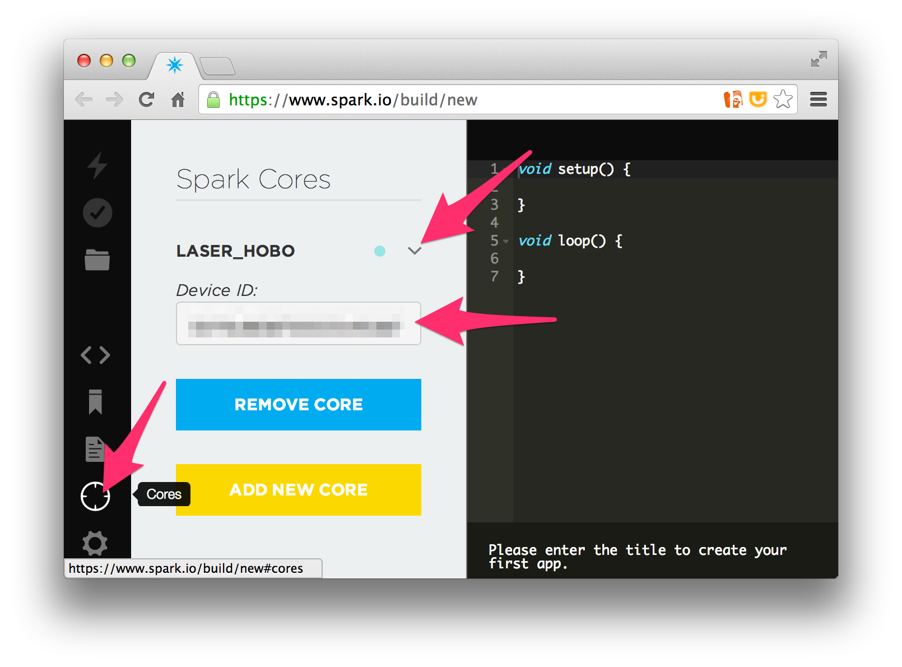
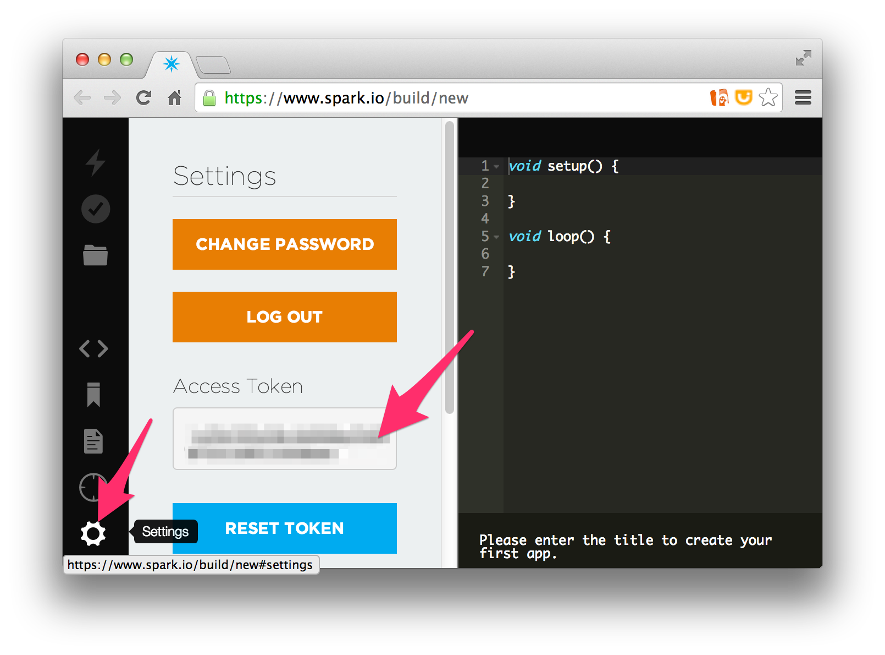

#Chapter 1 - Spark Core

#Step 1: Setup

####Aim: Turn on and off the `D7` LED on Spark Core from the mobile app

1. **Create a Spark Core account**

	1. Go to the [Spark Core website](https://www.spark.io/)
	- Click `Launch` to create an account
- Glance through the [documentation](http://docs.spark.io/api/)
	- Blinking [LED colors/actions and their meanings](http://docs.spark.io/start/#step-3-connect-your-core-to-the-cloud) 
	- Spark Core [pinout diagram](http://docs.spark.io/assets/images/spark-pinout.png)
- **Connect the Spark Core**
	1.  Go through the steps in the [starting docs](http://docs.spark.io/start/)
	- Plug the micro USB of the Spark Core to your laptop and see the blinking blue light
- **Connect the Spark Core to a mobile app**
	1. [Download iPhone or Android app](step-2-install-the-app) `Spark Core` 
	- [Connect the Core](http://docs.spark.io/connect/) to the Wifi
	- From your mobile app, tap on `D7` pin to turn on and off the LED on the Spark Core. `D7` is the on-board blue LED on the Spark Core.

#Step 2: Curl

####Aim: Turn on and off the `D7` LED with HTTP via curl commands

1. Get your `Device ID` and `Access Token`
	1. Get your `Device ID` from [here](https://www.spark.io/build/new#cores) and click on `Core`
	
	

	- Get your `Access Token` from [here](https://www.spark.io/build/new#cores) and click on `Settings`
	
	
- Connect to your Spark Core from your laptop's command line with a HTTP GET request using the Spark API. Note the 4 exposed functions "digitalread", "digitalwrite", "analogread" and "analogwrite"

  ```
  $ curl -X GET -H "Authorization: Bearer {ACCESS_TOKEN}" https://api.spark.io/v1/devices/{DEVICE_ID}

  {
    "id": "{DEVICE_ID}",
    "name": "{DEVICE_NAME}",
    "connected": true,
    "variables": {},
    "functions": [
      "digitalread",
      "digitalwrite",
      "analogread",
      "analogwrite"
    ]
  }
  ```
- Now, turn on and off the `D7` LED with Spark API using the HTTP POST request

	1. Turn on the LED with params `D7,HIGH`
	
	  ```
	  curl -X POST -H "Authorization: Bearer {ACCESS_TOKEN}" https://api.spark.io/v1/devices/{DEVICE_ID}/digitalwrite -d params=D7,HIGH
	
	  {
	    "id": "{DEVICE_ID}",
	    "name": "{DEVICE_NAME}",
	    "last_app": null,
	    "connected": true,
	    "return_value": 1
	  }
	  ```
	- Turn off the LED with params `D7,LOW`
	
	  ```
	  curl -X POST -H "Authorization: Bearer {ACCESS_TOKEN}" https://api.spark.io/v1/devices/{DEVICE_ID}/digitalwrite -d params=D7,HIGH
	
	  {
	    "id": "{DEVICE_ID}",
	    "name": "{DEVICE_NAME}",
	    "last_app": null,
	    "connected": true,
	    "return_value": 1
	  }
	  ```
	  
#Step 3: Setup with Node.js

####Aim: Turn on and off the `D7` LED with node

1. **Load the firmware**
	1. Load the firmware with just the [5-step instructions](https://github.com/voodootikigod/voodoospark#loading-the-firmware) 
	- Run the curl command again and see what functions are exposed now
	
		```
		$ curl -X GET -H "Authorization: Bearer {ACCESS_TOKEN}" https://api.spark.io/v1/devices/{DEVICE_ID}
		
		{
		  "id": "{DEVICE_ID}",
		  "name": "{DEVICE_NAME}",
		  "connected": true,
		  "variables": {
		    "endpoint": "string"
		  },
		  "functions": [],
		  "cc3000_patch_version": "1.29"
		}
		``` 
	- Check the local IP address of the Spark Core. `result` will give you the IP.
	
		```
		$ curl -X GET -H "Authorization: Bearer {ACCESS_TOKEN}" https://api.spark.io/v1/devices/{DEVICE_ID}/endpoint
		
		{
		  "cmd": "VarReturn",
		  "name": "endpoint",
		  "result": "{LOCAL_IP_ADDRESS}",
		  "coreInfo": {
		    "last_app": "",
		    "last_heard": "{CURRENT DATETIME}",
		    "connected": true,
		    "deviceID": "{DEVICE_ID}"
		  }
		}
		
		```
- **Creat blinking LED with Node**
	1. Install Spark-io with `npm install spark-io`
	- [Store the `Device ID` and `Access Token`](https://github.com/rwaldron/spark-io#getting-started) in a `~/.sparkrc` file 
	- Create a [blinking LED node script](https://github.com/rwaldron/spark-io#blink-an-led)
	- Create the [blinking LED with Johnny Five plugin](https://github.com/rwaldron/spark-io#johnny-five-io-plugin)
	- Create another node script. When you run this the [node repl](http://nodejs.org/api/repl.html) will appear
	
		```
		var five = require("johnny-five");
		var Spark = require("spark-io");
	
		var board = new five.Board({
		  io: new Spark({
		    token: process.env.SPARK_TOKEN,
		    deviceId: process.env.SPARK_DEVICE_ID
		  })
		});
		
		board.on("ready", function() {
		  var led = new five.Led("D7");
		
		  board.repl.inject({
		    led: led
		  });
		
		});
		```
		Turn on / off the LED in the repl with these commands:
		- `>> led.on()`
		- `>> led.off()`
		
		Blink / stop the LED in the repl with these commands:
		- `>> led.blink()`
		- `>> led.stop()`
		
#Chapter 2 - Motors


#Chapter 3 - Lets make Boat!